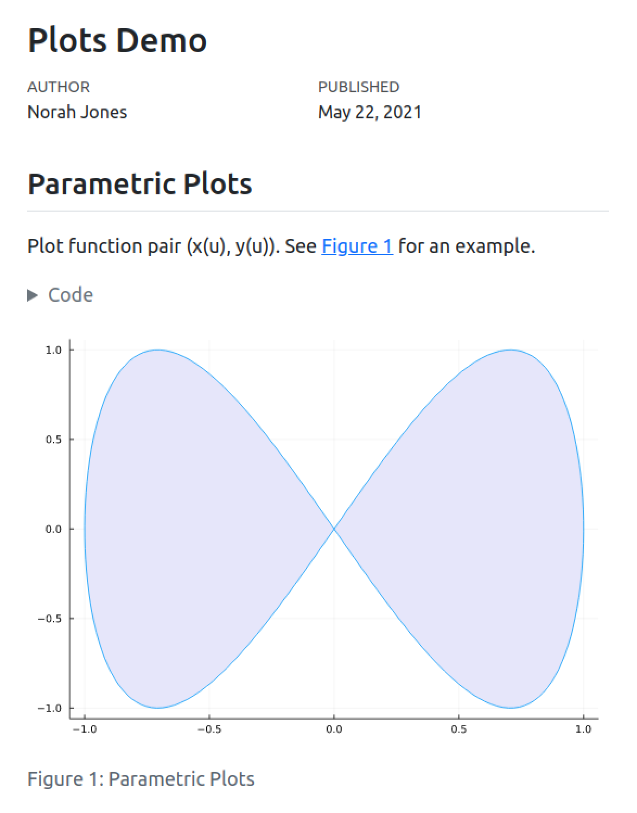

## What's Quarto? <https://quarto.org>

1. An open-source CLI for technical publishing based on Pandoc Markdown
1. A language-agnostic, next-gen version of RMarkdown
1. A static site generator great for "code-heavy content"
1. A batteries-included Pandoc orchestrator

Great support for editor extensions, ...except for collaborative writing 😬

## Hello, Quarto

:::: {.columns style="font-size: 0.6em"}

::: {.column width="10%"}
:::

::: {.column width="40%"}
````qmd
---
title: "Plots Demo"
author: "Norah Jones"
date: "5/22/2021"
format:
  html:
    code-fold: true
engine: julia
---

## Parametric Plots

Plot function pair (x(u), y(u)). 
See @fig-parametric for an example.

```{{julia}}
#| label: fig-parametric
#| fig-cap: "Parametric Plots"

using Plots

plot(sin, 
     x->sin(2x), 
     0, 
     2π, 
     leg=false, 
     fill=(0,:lavender))
```
````
:::

::: {.column width="40%"}
{style="height:50vh"}
:::

::::

<!-- viewer postcondition: they know we're about rich text -->

## What do we want Automerge for?

- our users fall back to Google Docs or Overleaf, then transfer over to Quarto when the collaboration "cools down".
- We want multiplayer editing/commenting for prose, presentations.

## Who do we want Automerge for?

- often, someone is the "technically-minded" person in the team
  - another person is the "PI", "manager", "boss", or "editor"
- The editor wants a document preview (perfect fidelity is not necessary), and wants to lightly change to the document
  - They **will never install a Quarto CLI** -- a web interface is required

## Discl\{aimer, osure\}s

- Quarto Hub is in very active development, everything about it might change
- See it live at <https://cscheid.net/static/quarto-hub> 
  - github: [`quarto-dev/q2`](https://github.com/quarto-dev/q2)
  - don't use it for anything important, please!

## It's 2026

- We've been using LLMs extensively

- We think we're doing it carefully and responsibly (and successfully!) but we understand there are smart folks who disagree
  
- we just don't want to derail the workshop in this direction

# Quarto + Automerge

## Project Automerge document

A Quarto project is a collection of .qmd files, metadata, and assets in a directory structure.

```json
{
  "files": {
    "_quarto.yml": "2qAkwgpmYyG8YnAB2pPE76suqCm1",
    "index.qmd": "49FzeY7oeoqyWtfwpoD6babnAyWa"
  }
}
```

<!--

Why more than one Automerge document?

- We speculated that this would make localized undo easier
  -  (and believe we have evidence to support this claim)
- We also wanted an escape valve for performance in large documents

-->

## Document Automerge documents

```json
{
  "text": "Hello world.\n"   
}
```

- This is where you might be thinking "uhhh, what?"
- Pandoc understands rich text, and so does Automerge, so why not represent that directly?
    - (If you know where to search, you'll find a quarto Automerge experiment based around peritext from a long time ago!)

<!-- spans, we've seen / messed around with peritext, etc. -->

## Quarto's rendering pipeline

::: {style="display: flex; gap: 1rem"}

::: {.flex-diagram style="background: rgb(197, 176, 176)"}
`.qmd`
:::

→

::: {.flex-diagram style="background: rgb(220, 177, 97)"}
AST
:::

→

::: {.flex-diagram style="background: rgb(169, 213, 183)"}
HTML
:::

:::

::: {style="display: flex; gap: 1rem; padding-top: .1em"}

::: {.flex-diagram style="background: rgb(197, 176, 176)"}

::: {style="font-size: .8em"}
```
## Hello world

[link](https://google.com)
```
:::

:::

→

::: {.flex-diagram style="background: rgb(220, 177, 97)"}

::: {style="font-size: .7em"}
```
{"pandoc-api-version":[1,23,1],"meta":{},"blocks":[{"t":"Header","c":[2,["hello-world",[],[]],[{"t":"Str",
"c":"Hello"},{"t":"Space"},
{"t":"Str",
"c":"World"}]]},{"t":"Para","c":[{"t":"Link","c":[["",[],[]],[{"t":"Str","c":"link"}],["google",""]]}]}]}
```
:::

:::

→

::: {.flex-diagram style="background: rgb(169, 213, 183)"}

::: {style="font-size: .8em"}
```
<h2>Hello World<h2>

<p>
<a href="google">link</a>
</p>
```
:::
:::

:::


<!-- consider showing an AST before proceeding somehow,
or overview of quarto pipeline-->

## The essential tension

- some players in the session will use rich text
- some players in the session will use plain text

**something, somewhere must manage a bidi translation between text and AST**

<!-- No asts at rest -->

## Quarto 2

- Rust rewrite (WASM)
- take over entire md→output pipeline
- new ideas:
  - track source locations and spans throughout
  - embrace incremental writes

## Case study: Quarto execution engines

- Quarto's "execution engines" run (eg) Python or R code and produce output in Markdown.
  - The API is "Markdown text in, Markdown text out (+ filesystem effects)"
- This is central to "reproducible computational documents"
  - (Yes, it's "notebooks", though Quarto's lineage predates Jupyter by \~25 years)

## Maintaining source location

Imagine we want to walk to AST to find bad URLs in links.
How should we report the error if the parser sees the engine Markdown?

::: {style="display: flex; gap: 1rem"}

::: {.flex-diagram style="background: rgb(197, 176, 176)"}

::: {style="font-size: .5em"}
````
```{{python}}
print("Hello, world: %s" % (1 + 3))
```

a [bad link](htp://ohno).
````
:::

:::

→

::: {.flex-diagram style="background: rgb(220, 177, 97)"}

::: {style="font-size: .5em"}
````
::: {#13a46395 .cell execution_count=1}
``` {.python .cell-code}
print("Hello, world: %s" % (1 + 3))
```

::: {.cell-output .cell-output-stdout}
```
Hello, world: 4
```
:::
:::

a [bad link](htp://ohno).
````
:::

:::

→

::: {.flex-diagram style="background: rgb(169, 213, 183)"}

::: {style="font-size: .5em"}
```
{"pandoc-api-version":[1,23,1],"meta":{"echo":{"t":"MetaBool","c":true},"keep-md":{"t":"MetaBool","c":true}},"blocks":[{"t":"Div","c":[["13a46395",["cell"],[["execution_count","1"]]],[{"t":"CodeBlock","c":[["",["python","cell-code"],[]],"print(\"Hello, world: %s\" % (1 + 3))"]},{"t":"Div","c":[["",["cell-output","cell-output-stdout"],[]],[{"t":"CodeBlock","c":[["",[],[]],"Hello, world: 4"]}]]}]]},{"t":"Para","c":[{"t":"Str","c":"a"},{"t":"Space"},{"t":"Link","c":[["",[],[]],[{"t":"Str","c":"bad"},{"t":"Space"},{"t":"Str","c":"link"}],["htp://ohno",""]]},{"t":"Str","c":"."}]}]}
```
:::
:::

:::


## Tree reconciliation (1/2)

```python
ast = parse_with_locations(input)
engine_output = run_engine(input)
ast = reconcile(ast, parse_with_locations(engine_output))
```

- Now `ast` holds nodes with source locations from both `input` and `engine_output`.
  - we "patch in" only the engine execution code, _with source locations_.
- We can carry this information all the way to HTML.

## Tree reconciliation (2/2)

::: {style="display: flex; gap: 1rem"}

::: {.flex-diagram .ast-1}
````
```python
print("Hello, world")
```

a [bad link](htp://ohno).
````
:::

::: {.flex-diagram .ast-2}
````
```
Hello, world
```

a [bad link](htp://ohno).
````
:::

:::

Reconciled output:

::: {.ast-2}
````
```
Hello, world
```
````
:::

::: {.ast-1}
```
a [bad link](htp://ohno).
```
:::

## Tree reconciliation, backwards...

We can run this algorithm **in reverse**!

- AST → qmd is just a markdown writer
- A JS editor changes DOM → new HTML → new AST
- Two AST with source locations can be reconciled

## ... becomes incremental writer

- AST → qmd writer can reuse existing markdown from previous parse if no subtree content has changed
  - Localized changes in AST induce localized-in-string-span changes in text
- punchline for this crowd: _AST changes behave well in Automerge_.

<!-- screenshot of dom inspector with data-loc -->

## A WASM Markdown→HTML pipeline

- We're rewriting the parts of Pandoc that are important for this pipeline in pure Rust
- it's the `pampa` crate in `quarto-dev/q2`
- It compiles to WASM, drives Quarto Hub.
- Currently, full render preview per keystroke

<!-- diagram: read and write arrows:
        quarto-sync-client  parse/inc edit.  component extensions
Automerge string <-> qmd content <-> AST <-> rendered thing -->


## `hub-client`: SPA for Quarto Hub

- A vite project that compiles to a static HTML+JS+WASM distribution
- You choose your Automerge sync server
- It uses `quarto-sync-client`, a small abstraction layer over Automerge for Quarto projects
  - TS pub-sub client over project and document changes

## Current features

- HTML doc preview
- Slides (driving this pres)
- replay of Automerge contents for long-range history

## Ongoing work

## BYO bidi components (1/2)

we want you to build on top of this:

- user redefinable components in existing render formats
- components have API for 
  - constructing from AST, 
  - changing their state,
  - writing to AST, is reflected back to the source via reconciliation + incremental write

## BYO bidi components (2/2)

- Our "Google Slides"-like render format is where we are initially experimenting with this
  - direct manipulation of slide content. e.g. drag&drop images, change text, etc.
- lil dashboards and one-offs: eg `q2-demos/kanban`

## The future Q+A ecosystem

::: {style="display: flex; gap: 1rem"}

::: {.flex-diagram style="background-color: #c88"}
Automerge
:::

↔

::: {.flex-diagram style="background-color: #c88"}
Qmd
:::

↔

::: {.flex-diagram style="background-color: #c88"}
AST
:::

↔

::: {.flex-diagram style="background-color: #c88"}
Bidi
:::

:::


## Things we'd love to talk with you about

## `inkandswitch/pushwork`

Should we change or ditch our Automerge schema entirely? We have time.

## Automerge auth/access control

We are running a fork of samod that, at WebSocket upgrade time:

- Client: (Google) OIDC login returning JWT as HttpOnly cookie
- Server: JWT validation against cached provider keys
- Email and domain allowlists

Automerge-repo protocol level:

- Ported `AccessPolicy` from Automerge-repo to samod
- Using for document access logging only for now

## Thank you!

- repo: <https://github.com/quarto-dev/q2>
- best deployment for you: <https://cscheid.net/static/quarto-hub/>
- Our "official" deployment: <https://quarto-hub.com>
  - let us know if you want access, it's behind google auth
- Our team: Carlos Scheidegger, Gordon Woodhull, Elliot Evans, Christophe Dervieux, Charlie Gao, Charlotte Wickham, Mine Cetinkaya-Rundel, Andrew Holz

Personally speaking, Automerge is life-changing tech. I can't wait to build more with it.


